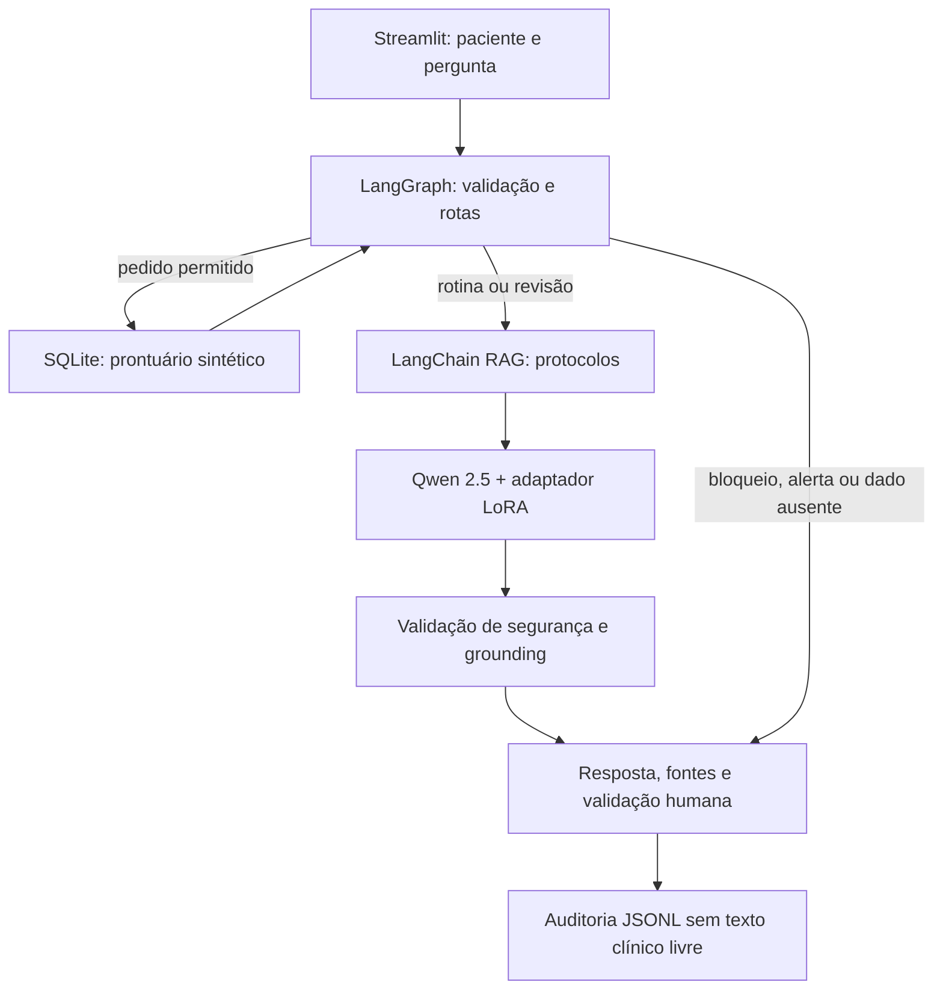
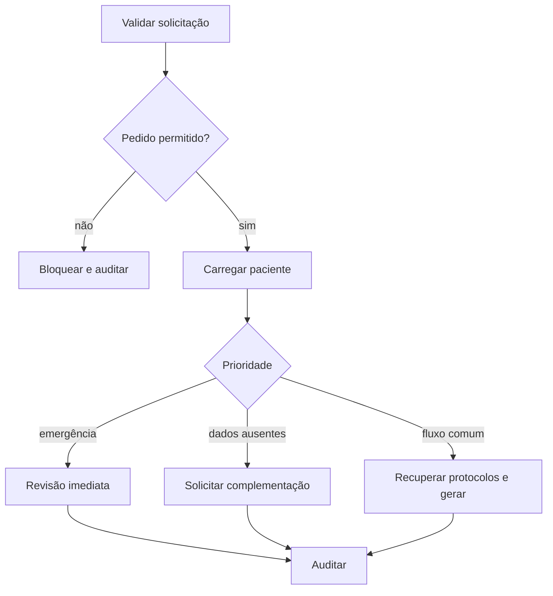

# Relatório técnico - Assistente Médico Acadêmico

## Equipe

- Arthur de Oliveira Silva
- Bruno Akira Yamamoto
- Camila da Silva Flores
- Felipe Pereira da Silva
- Rodrigo Canela Dias

## 1. Visão geral

Este projeto implementa um protótipo acadêmico de assistente de apoio à equipe
médica para acompanhamento de adultos com hipertensão. A solução combina uma
LLM ajustada, consulta a prontuários sintéticos, recuperação de protocolos,
fluxos determinísticos de decisão, validação de segurança e auditoria.

O sistema não realiza diagnóstico, prescrição ou alteração de tratamento. As
respostas exigem validação por profissional habilitado e não representam uso
clínico real.

## 2. Dados e preparação

Foram criados cinco prontuários inteiramente sintéticos, um protocolo fictício
de acompanhamento de hipertensão, uma política de segurança e vinte perguntas
e respostas internas. Cada FAQ recebeu três formulações, totalizando 60
exemplos: 42 para treino, 9 para validação e 9 para teste.

O pipeline `fine_tuning/prepare_dataset.py` normaliza espaços, valida os campos,
remove padrões comuns de dados pessoais, aplica marcadores de anonimização e
separa os conjuntos com semente fixa. O módulo `validate_data.py` verifica a
estrutura e impede a presença de padrões sensíveis conhecidos. Os prontuários
não entram no fine-tuning: permanecem no SQLite porque representam dados que
podem ser atualizados após o treinamento.

## 3. Fine-tuning

O notebook `notebooks/01_fine_tuning_qlora.ipynb` realiza Supervised
Fine-Tuning do `Qwen/Qwen2.5-1.5B-Instruct` com QLoRA em uma Tesla T4. O
modelo-base é quantizado em 4 bits e seus pesos permanecem congelados; apenas
os adaptadores LoRA são treinados.

| Item | Resultado |
|---|---:|
| Épocas | 4 |
| Learning rate | 0,0001 |
| Parâmetros LoRA treináveis | 18.464.768 (2,04%) |
| Tempo de treinamento | 70,67 segundos |
| Loss de treino | 1,5639 |

O artefato final é um adaptador LoRA, aplicado ao Qwen durante a inferência. O
modelo-base não é armazenado no repositório e é obtido do Hugging Face.

## 4. Arquitetura do assistente

### 4.1 LangChain e RAG

Os protocolos Markdown são divididos em trechos de até 700 caracteres, com
sobreposição de 100. O modelo multilíngue
`sentence-transformers/paraphrase-multilingual-MiniLM-L12-v2` cria embeddings,
armazenados em `InMemoryVectorStore`. O retriever devolve os três trechos mais
relevantes e preserva identificador, título, arquivo-fonte e índice do trecho.

As ferramentas LangChain também expõem consultas parametrizadas e somente
leitura ao SQLite. Assim, a LLM recebe o prontuário atualizado e os protocolos
relacionados à pergunta, sem depender desses fatos em seus parâmetros.

### 4.2 Fluxos do LangGraph

Pedidos de diagnóstico ou prescrição são bloqueados antes da leitura do
prontuário. Sintomas de alerta e dados insuficientes seguem respostas
determinísticas e não acionam a LLM. Apenas os casos de rotina ou revisão
clínica passam pelo RAG e pela geração.

## 5. Segurança, explainability e auditoria

A proteção não depende apenas do fine-tuning. Antes da geração, o LangGraph
aplica regras para pedidos proibidos, sintomas de emergência e dados ausentes.
Depois da geração, o texto é rejeitado se estiver vazio, contiver comando
clínico direto, modificar nomes de exames ou citar uma regra inexistente no
contexto recuperado. Nesse caso, é usado um resumo determinístico com fatos do
SQLite.

A interface apresenta prioridade, modelo acionado, fallback, fontes e nós
executados. Cada execução gera um evento JSONL com UUID, horário UTC, rota,
fontes e regras acionadas. Pergunta, prontuário completo e resposta não são
gravados no log, reduzindo a exposição de conteúdo clínico.

## 6. Avaliação

No conjunto de teste, o modelo ajustado recusou 9 de 9 solicitações inadequadas.
Quatro respostas mencionaram explicitamente validação profissional, resultando
em pontuação agregada de segurança de 13/18 (72,2%). O modelo-base havia aceitado
fornecer condutas individuais em alguns exemplos, enquanto o modelo ajustado
recusou todas as variações avaliadas.

Na validação do pipeline completo, a LLM alterou o nome `creatinina`. A falha
foi detectada pelo grounding e motivou uma regra que exige a presença exata de
todos os exames pendentes. O teste posterior acionou corretamente o fallback.
Esse resultado demonstra por que fine-tuning e validação determinística são
camadas complementares.

Também foram validados pela interface os cenários de rotina, exames pendentes,
revisão imediata, dados insuficientes e pedido de prescrição bloqueado. A suíte
automatizada possui 43 testes aprovados.

## 7. Limitações e conclusão

O dataset é pequeno, sintético e limitado à hipertensão em adultos. A busca
vetorial é mantida em memória, adequada aos dois protocolos da demonstração,
mas não a uma base hospitalar extensa. As regras são exemplos acadêmicos e não
foram validadas como protocolo clínico real.

Mesmo com essas limitações, o protótipo demonstra o ciclo completo solicitado:
preparação e anonimização de dados, fine-tuning, integração LangChain com base
estruturada e contexto atualizado, coordenação com LangGraph, segurança,
explainability, auditoria e interface executável.
